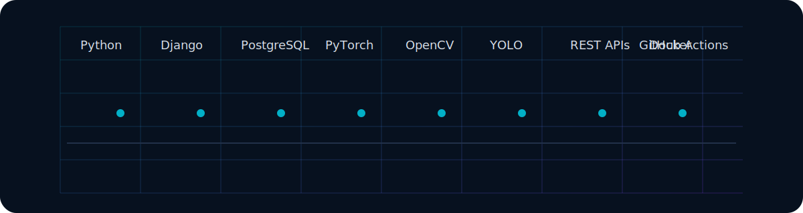

# HIJBULLAH AI LAB

# Md. Taher Bin Omar Hijbullah

**AI Research Engineer**

Computer vision, autonomous systems, backend engineering, and applied research.

Building production AI systems with research depth and startup-grade execution.

## Mission

Designing and shipping AI systems that turn research into dependable products.

## Current Focus

<table>
<tr>
<td align="center" width="25%"><strong>Attention-Guided YOLOv11</strong></td>
<td align="center" width="25%"><strong>DeepScope Research</strong></td>
<td align="center" width="25%"><strong>Medical AI</strong></td>
<td align="center" width="25%"><strong>Intelligent Transportation</strong></td>
</tr>
</table>

## Featured Projects

Six repositories surfaced automatically from the portfolio.

<table>
<tr>
<td valign="top" width="50%">

**ANTLINGS_Drone**  
# ANTLINGS Drone Computer Vision Pipeline **Autonomous Drone-Based Detection, Tracking & Counting System** A high-performance computer visi…

- Language: Jupyter Notebook
- Stars: 0 | Forks: 0
- Updated: 1 month ago

[Repository](https://github.com/hijbullahx/ANTLINGS_Drone)

</td>
<td valign="top" width="50%">

**MushCare**  
# MushCare: Intelligent Autonomous Farm Ecosystem MushCare is an advanced, AI-integrated IoT ecosystem designed to optimize mushroom cultiv…

- Language: C++
- Stars: 0 | Forks: 0
- Updated: 25 days ago

[Repository](https://github.com/hijbullahx/MushCare)

</td>
</tr>
<tr>
<td valign="top" width="50%">

**Breast-Cancer-MRI-YOLOv11**  
# Breast Cancer Detection using YOLOv11 

</td>
<td valign="top" width="50%">

**BD_Autonomous_YOLOv11**  
# Bangladesh-Adapted YOLOv11 for Autonomous Vehicles ## Thesis Overview **Title:** A Bangladesh-Adapted YOLOv11 Object Detection Model for…

- Language: Python
- Stars: 0 | Forks: 0
- Updated: 6 months ago

[Repository](https://github.com/hijbullahx/BD_Autonomous_YOLOv11)

</td>
</tr>
<tr>
<td valign="top" width="50%">

**SynthAI-Squad_AutomaticPriceComparison**  
# SynthAI Squad: Automatic Service Price & Review Comparison **Project for the SOLVIO AI Hackathon** Our platform helps users make informed…

- Language: Python
- Stars: 0 | Forks: 0
- Updated: 7 months ago

[Repository](https://github.com/hijbullahx/SynthAI-Squad_AutomaticPriceComparison)

</td>
<td valign="top" width="50%">

**IoTGenie**  
Render

- Language: Python
- Stars: 0 | Forks: 0
- Updated: 9 months ago

[Repository](https://github.com/hijbullahx/IoTGenie) · [Live Demo](https://iotgenie.onrender.com/)

</td>
</tr>
</table>

## Technology Stack

| Area | Stack |
| --- | --- |
| AI | PyTorch · OpenCV · YOLO · Transformers |
| Backend | Django · DRF · PostgreSQL · REST APIs |
| Databases | PostgreSQL · SQLite · Firebase · MongoDB |
| Tools | GitHub Actions · Docker · Linux · Jupyter |
| Cloud | Render · Vercel · Streamlit · GitHub Pages |
| IoT | ESP32 · ESP8266 · Sensors · Automation |
| Research | Papers · Benchmarks · Experiments · Reproducibility |
| Languages | Python · Jupyter Notebook · Unknown · HTML |

## GitHub Analytics

  
  

  

  

  

## Research Journey

Python

↓

Backend Engineering

↓

Computer Vision

↓

Applied AI

↓

Medical AI

↓

Autonomous Systems

## Connect With Me

## Animated Footer

