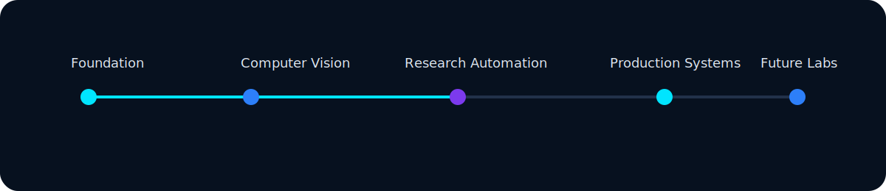
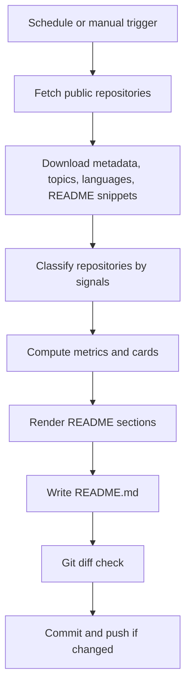

# HIJBULLAH AI LAB

## Hero Section



I build production AI systems that make research visible, measurable, and deployable. HIJBULLAH AI LAB is the public face of that work: computer vision, autonomous systems, backend engineering, and automation designed to look and behave like a modern research studio.

## Who I Am

Md. Taher Bin Omar Hijbullah builds under HIJBULLAH AI LAB as a AI Research Engineer. Computer vision, autonomous systems, backend engineering, and applied research. Final-year Computer Science & Engineering student focused on production AI systems. The profile is intentionally positioned around engineering output: research systems, reproducible experiments, and production software that can stand in front of labs, recruiters, and collaborators with equal confidence.

## Current Research

- Computer Vision
- Autonomous Systems
- Intelligent Transportation
- Medical AI
- Robotics
- Open Source AI

The live portfolio surface is tuned to these areas so the profile reads like a research lab rather than a student snapshot.

## Live Mission Status

| Area | Focus | Status |
| --- | --- | --- |
| Vision Systems | Detection, tracking, and scene understanding | Active |
| Research Engineering | Automation, analysis, and reproducibility | Active |
| Backend Platforms | APIs, data models, and operational tooling | Active |
| IoT Systems | Embedded sensing and automation | Ongoing |
| Open Source | Public tools, reusable components, and workflows | Active |

## Featured Projects

The project gallery below is generated from live repository intelligence. It favors repositories that demonstrate research relevance, production value, active maintenance, and strong documentation.

<table>
<tr>
<td valign="top" width="50%">

**ANTLINGS_Drone**  
No description provided.

- Stack: Jupyter Notebook
- Topics: None
- Primary language: Jupyter Notebook
- Stars: 0 | Forks: 0 | Size: 154042 KB
- Last updated: 1 month ago (2026-05-18)

[Repository](https://github.com/hijbullahx/ANTLINGS_Drone) · [Documentation](https://github.com/hijbullahx/ANTLINGS_Drone/blob/main/README.md)

</td>
<td valign="top" width="50%">

**MushCare**  
No description provided.

- Stack: C++
- Topics: None
- Primary language: C++
- Stars: 0 | Forks: 0 | Size: 45 KB
- Last updated: 25 days ago (2026-06-06)

[Repository](https://github.com/hijbullahx/MushCare) · [Documentation](https://github.com/hijbullahx/MushCare/blob/main/README.md)

</td>
</tr>
<tr>
<td valign="top" width="50%">

**Breast-Cancer-MRI-YOLOv11**  
No description provided.

- Stack: Python
- Topics: None
- Primary language: Python
- Stars: 1 | Forks: 0 | Size: 62 KB
- Last updated: 4 months ago (2026-02-07)

[Repository](https://github.com/hijbullahx/Breast-Cancer-MRI-YOLOv11) · [Documentation](https://github.com/hijbullahx/Breast-Cancer-MRI-YOLOv11/blob/main/README.md)

</td>
<td valign="top" width="50%">

**BD_Autonomous_YOLOv11**  
No description provided.

- Stack: Python
- Topics: None
- Primary language: Python
- Stars: 0 | Forks: 0 | Size: 1045 KB
- Last updated: 6 months ago (2025-12-22)

[Repository](https://github.com/hijbullahx/BD_Autonomous_YOLOv11) · [Documentation](https://github.com/hijbullahx/BD_Autonomous_YOLOv11/blob/main/README.md)

</td>
</tr>
<tr>
<td valign="top" width="50%">

**SynthAI-Squad_AutomaticPriceComparison**  
No description provided.

- Stack: Python, Cython, C, C++
- Topics: None
- Primary language: Python
- Stars: 0 | Forks: 0 | Size: 320971 KB
- Last updated: 7 months ago (2025-11-09)

[Repository](https://github.com/hijbullahx/SynthAI-Squad_AutomaticPriceComparison) · [Documentation](https://github.com/hijbullahx/SynthAI-Squad_AutomaticPriceComparison/blob/main/README.md)

</td>
<td valign="top" width="50%">

**IoTGenie**  
Render

- Stack: Python, HTML
- Topics: None
- Primary language: Python
- Stars: 0 | Forks: 0 | Size: 21278 KB
- Last updated: 9 months ago (2025-09-21)

[Repository](https://github.com/hijbullahx/IoTGenie) · [Documentation](https://github.com/hijbullahx/IoTGenie/blob/main/README.md) · [Live Demo](https://iotgenie.onrender.com/)

</td>
</tr>
<tr>
<td valign="top" width="50%">

**machine_learning_portfolio**  
No description provided.

- Stack: Python
- Topics: None
- Primary language: Python
- Stars: 0 | Forks: 0 | Size: 195692 KB
- Last updated: 3 days ago (2026-06-28)

[Repository](https://github.com/hijbullahx/machine_learning_portfolio) · [Documentation](https://github.com/hijbullahx/machine_learning_portfolio/blob/main/README.md) · [Live Demo](https://hijbullahml.streamlit.app/)

</td>
<td valign="top" width="50%">

**MyCode**  
No description provided.

- Stack: Python, C, Tcl, C++
- Topics: None
- Primary language: Python
- Stars: 0 | Forks: 0 | Size: 197360 KB
- Last updated: 20 days ago (2026-06-11)

[Repository](https://github.com/hijbullahx/MyCode) · [Documentation](https://github.com/hijbullahx/MyCode/blob/main/README.md)

</td>
</tr>
<tr>
<td valign="top" width="50%">

**NN_Basics**  
No description provided.

- Stack: Python, PowerShell, Jupyter Notebook
- Topics: None
- Primary language: Python
- Stars: 0 | Forks: 0 | Size: 6496 KB
- Last updated: 11 months ago (2025-08-01)

[Repository](https://github.com/hijbullahx/NN_Basics) · [Documentation](https://github.com/hijbullahx/NN_Basics/blob/main/README.md)

</td>
<td valign="top" width="50%">

**SMART-PLANT-WATERING-SYSTEM-WITH-NodeMCU-ESP8266**  
No description provided.

- Stack: C++
- Topics: None
- Primary language: C++
- Stars: 0 | Forks: 0 | Size: 545 KB
- Last updated: 1 year ago (2024-12-27)

[Repository](https://github.com/hijbullahx/SMART-PLANT-WATERING-SYSTEM-WITH-NodeMCU-ESP8266) · [Documentation](https://github.com/hijbullahx/SMART-PLANT-WATERING-SYSTEM-WITH-NodeMCU-ESP8266/blob/main/README.md)

</td>
</tr>
<tr>
<td valign="top" width="50%">

**Tic-Tac-Toe-Playable-in-Browser-Open-Source**  
Tic-Tac-Toe \| Playable in Browser \| Open Source A simple Tic-Tac-Toe game built with HTML, CSS, and JavaScript. Play against a friend, track turns, and enjoy automatic winner detection. Includes Reset and New Game optio…

- Stack: JavaScript, CSS, HTML
- Topics: None
- Primary language: JavaScript
- Stars: 0 | Forks: 0 | Size: 104 KB
- Last updated: 1 year ago (2025-03-05)

[Repository](https://github.com/hijbullahx/Tic-Tac-Toe-Playable-in-Browser-Open-Source) · [Documentation](https://github.com/hijbullahx/Tic-Tac-Toe-Playable-in-Browser-Open-Source/blob/main/README.md)

</td>
<td valign="top" width="50%">

**tree_plantation_tracker**  
No description provided.

- Stack: Python, HTML, CSS
- Topics: None
- Primary language: Python
- Stars: 0 | Forks: 0 | Size: 17673 KB
- Last updated: 1 year ago (2025-06-19)

[Repository](https://github.com/hijbullahx/tree_plantation_tracker) · [Documentation](https://github.com/hijbullahx/tree_plantation_tracker/blob/main/README.md)

</td>
</tr>
</table>

## Auto Repository Gallery

The gallery is driven by repository metadata, topics, stars, recent activity, README content, and language signals. Categories are assigned automatically so the profile stays current as the portfolio evolves.

- Dominant languages: Python, Jupyter Notebook, Unknown, HTML, C++, JavaScript
- Dominant signals: Repo topics, README text, stars, and recent activity

## Research Timeline



- Foundation: computer science, Python, and backend engineering.
- Expansion: computer vision, deep learning, and applied AI experiments.
- Systems: research tooling, automation, and reproducible workflows.
- Direction: autonomous systems, medical AI, and high-trust deployment.

## Technology Universe


The stack is organized by function, not by badge clutter. Core focus areas: Computer Vision, Autonomous Systems, Intelligent Transportation, Medical AI, Robotics, Open Source AI.

This layout keeps the profile readable on desktop and mobile while still signaling breadth across languages, frameworks, databases, AI, cloud, DevOps, operating systems, and research tooling.

## GitHub Analytics

<div align="center">
  
  
</div>

<div align="center">
  
</div>

## Research Metrics

The automation pipeline converts portfolio data into high-signal metrics that matter to recruiters, research labs, and engineering teams: production-readiness, active maintenance, project diversity, research intensity, and documentation quality.

| Metric | Value | Meaning |
| --- | --- | --- |
| Public repositories | 27 | Live GitHub portfolio surface |
| Research repositories | 13 | Vision, medical AI, and research tooling |
| Production repositories | 15 | Backend, automation, and deployable systems |
| Top language | Python | Primary implementation stack |
| Most recent update | Today | Maintenance signal |

## Roadmap

- Expand the research surface with papers, benchmarks, and experimental notebooks.
- Keep the repository intelligence pipeline deterministic and easy to audit.
- Grow reusable modules for computer vision, backend APIs, and automation.
- Add more public demonstrations that combine engineering quality with research depth.

## Let's Build Together

This profile is designed for collaboration with open source maintainers, research labs, startup teams, and graduate programs that care about rigor. If you are looking for someone who can move between research, deployment, and product thinking, this profile is structured to make that clear.

## Live Widgets


## Animated Footer


The lab stays active by design: new experiments are classified automatically, and the profile refreshes without hand-maintained lists.

## Architecture Explanation

The repository is split into four layers: live data ingestion, classification, presentation generation, and scheduled publication. GitHub API data is pulled into the automation scripts, categorized by topic and content signals, transformed into project cards and metrics, and then written back into the profile README by GitHub Actions.

## Setup Guide

1. Set the GitHub repository owner in `config/settings.json` if you are not using the default profile account.
2. Add any optional widget usernames, RSS URLs, or social links to the configuration files.
3. Run `python automation/update_readme.py` locally to generate a fresh README snapshot.
4. Commit the result or let the scheduled workflow update it automatically.

## Installation Guide

The automation layer only depends on Python 3.10+ and the standard library. No external packages are required for the core generator, which keeps the workflow lightweight and fast.

```bash
python automation/update_readme.py
```

## Customization Guide

Update `config/categories.json` to shift category weights, `config/featured.json` to change spotlight logic, and `config/theme.json` to retune color and spacing decisions. The SVG assets are intentionally modular, so they can be replaced one by one without breaking the rest of the profile.

## Deployment Guide

The GitHub Action in `.github/workflows/update-profile.yml` runs on a schedule and on demand. It fetches public repositories, classifies them, regenerates the README, and commits changes only when the generated output is different.

## GitHub Actions Documentation

The workflow is designed for reliability over complexity. It uses `contents: write`, scheduled triggers, manual dispatch, a cache directory for API responses, and a conditional commit step so empty runs do not create noise.

## Maintenance Guide

- Review the category rules when new project types are added.
- Refresh optional widget usernames if external services change.
- Keep the README copy aligned with the actual direction of the lab.
- Let the workflow handle routine updates instead of editing the generated sections by hand.

## Troubleshooting Guide

- If the workflow cannot reach the GitHub API, check the token and rate limit behavior first.
- If a repository is missing from the profile, verify it is public and not archived.
- If a section looks empty, confirm the configuration file includes the relevant optional data.
- If the SVGs do not render, make sure the files are committed and referenced with the correct relative path.

## Scaling Suggestions

- Split larger experiments into separate repositories and let the classifier surface them automatically.
- Add more topic rules instead of manually curating project order.
- Keep generated content deterministic so the profile remains trustable over time.
- Use README sections as a living operating system for the lab instead of a static bio.

## Future Improvements

- Add paper citation parsing for research repositories.
- Add release intelligence so recent versioned work becomes more visible.
- Expand widget configuration for WakaTime, Spotify, LeetCode, Medium, Dev.to, and RSS modules.
- Generate per-project spotlight SVGs when a repository crosses defined thresholds.

## Folder Structure

```text
README.md
assets/
  hero.svg
  footer.svg
  wave.svg
  divider.svg
  particles.svg
  grid.svg
  matrix.svg
  neural-network.svg
  research.svg
  timeline.svg
automation/
  fetch_repositories.py
  classify_repositories.py
  generate_cards.py
  generate_sections.py
  generate_statistics.py
  update_readme.py
  utils.py
templates/
  hero.md
  projects.md
  stats.md
  footer.md
  timeline.md
  readme_template.md
config/
  settings.json
  featured.json
  categories.json
  theme.json
.github/
  workflows/
    update-profile.yml
```

## Workflow Diagram




