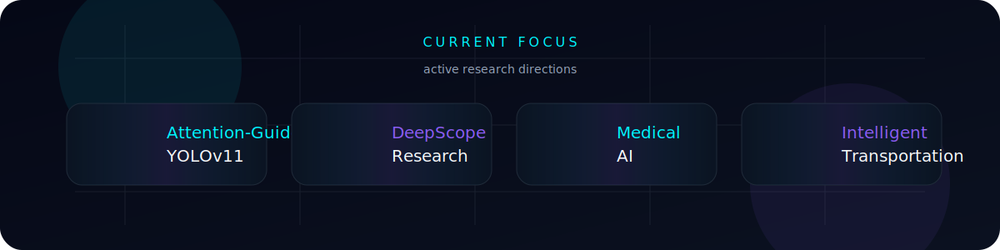
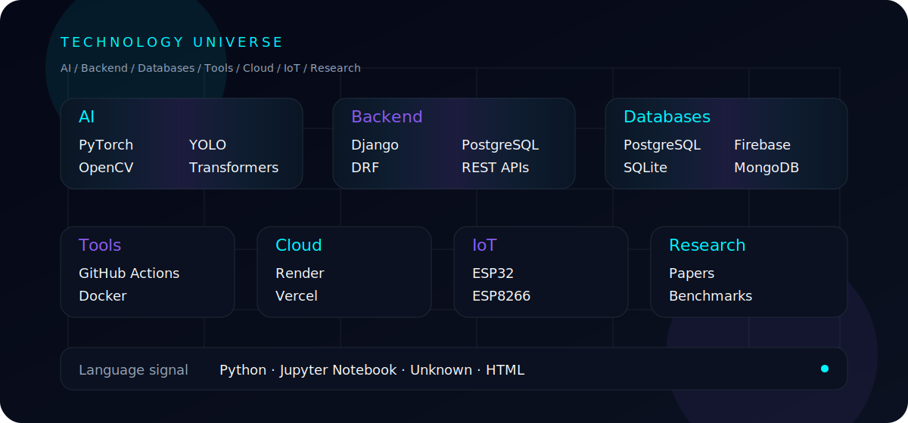
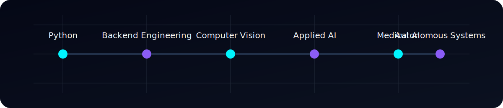

# HIJBULLAH AI LAB

# Md. Taher Bin Omar Hijbullah

**AI Research Engineer**

Computer vision, autonomous systems, backend engineering, and applied research.

Building production AI systems with research depth and startup-grade execution.

## Mission

Designing and shipping AI systems that turn research into dependable products.

## Current Focus

## Technology Stack

## GitHub Analytics

  

  

## Research Journey

## Connect With Me

## Animated Footer

